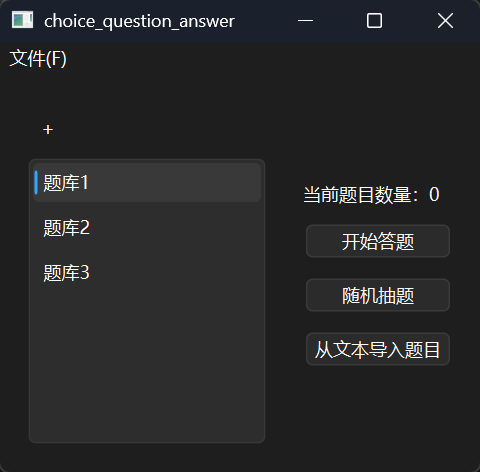
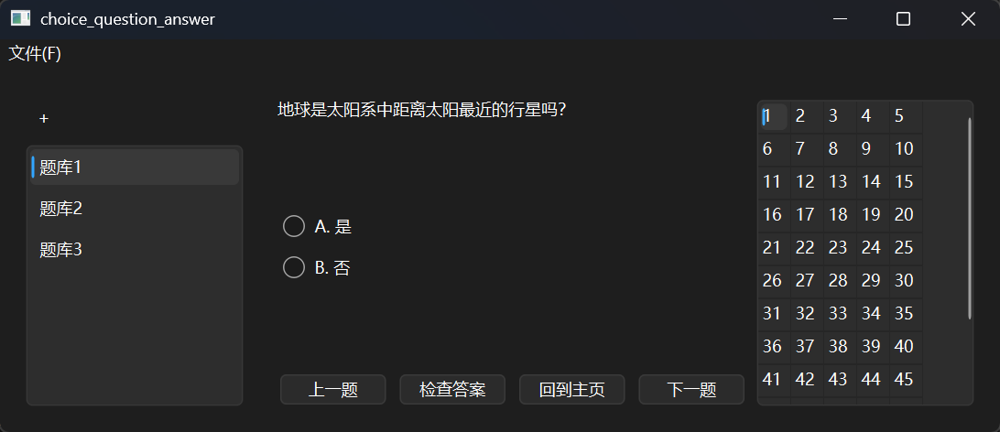

# Qt Question Answering System

一个基于 Qt + SQLite 开发的本地题库答题系统。  
支持多题库管理、随机抽题、JSON 导入、题库打包导出等功能。

---

## 项目预览

### 功能特点

- 📚 多数据库（题库）管理
- 🎯 顺序答题 / 随机抽题
- 📝 支持 JSON 文本导入题目
- 💾 SQLite 本地存储
- 📦 自定义 `.qpack` 题库打包导入导出
- 🔄 动态切换题库
- ✅ 自动判题
- 🖥 Qt Widgets 图形界面

---

# 技术栈

- Qt 6
- C++
- SQLite
- QuaZip / JlCompress

---

# 项目结构

```text
├── AnswerPage              // 答题页面
├── DatabaseManager         // 数据库管理
├── DatabaseSelectWidget    // 数据库选择组件
├── HomePage                // 主页面
├── ImportJsonPage          // JSON导入页面
├── JsonManager             // JSON解析
├── MainWindow              // 主窗口
├── MenuBar                 // 菜单栏
├── Question                // 题目类
├── QuestionsManager        // 题库管理
├── QuizManager             // 答题流程管理
├── QPackManager            // 题库打包管理
├── StartPage               // 启动页面
└── MyUtils                 // 工具函数
```

---

# 数据库存储结构

项目使用 SQLite 存储题目。

数据库包含三张表：

## Questions

```sql
CREATE TABLE Questions (
    id INTEGER PRIMARY KEY,
    title TEXT NOT NULL,
    count INTEGER NOT NULL,
    type INTEGER NOT NULL,
    image_count INTEGER NOT NULL,
    answer TEXT NOT NULL
);
```

## Options

```sql
CREATE TABLE Options (
    question_id INTEGER NOT NULL,
    option_key TEXT NOT NULL,
    option_text TEXT NOT NULL
);
```

## Images

```sql
CREATE TABLE Images (
    question_id INTEGER NOT NULL,
    url TEXT NOT NULL
);
```

---

# JSON 导入格式

程序支持直接导入 JSON 文本。

示例：

```json
{
  "questions": [
    {
      "id": 1,
      "type": 0,
      "title": "C++中用于输入的是？",
      "count": 4,
      "answer": "A",
      "image_count": 0,
      "options": {
        "A": "cin",
        "B": "cout",
        "C": "printf",
        "D": "scanf"
      }
    }
  ]
}
```

---

# 题目类型

| type | 类型 |
|------|------|
| 0 | 单选题 |
| 1 | 多选题 |
| 2 | 未定义 |

---

# 功能演示

## 1. 创建题库

- 左侧点击 `+`
- 输入数据库名称
- 自动创建 SQLite 数据库

---

## 2. 导入题目

主页点击：

```text
从文本导入题目
```

粘贴 JSON 即可导入。

---

## 3. 开始答题

支持：

- 顺序答题
- 随机抽题

---

## 4. 导出题库

菜单栏：

```text
文件 -> 导出题库
```

会生成：

```text
xxx.qpack
```

---

## 5. 导入题库

菜单栏：

```text
文件 -> 导入题库
```

支持导入 `.qpack` 文件。

---

# 构建方法

## Qt Creator

直接使用 Qt Creator 打开项目即可。

推荐环境：

- Qt 6.5+
- MinGW 64-bit

---

# 第三方库

## QuaZip

用于 `.qpack` 压缩与解压。

项目中使用：

- `JlCompress`
- `QuaZip`

---

# 已实现的设计特点

## 动态窗口尺寸

使用自定义：

```cpp
CurrentSizeStackedWidget
```

根据当前页面自动调整窗口大小。

---

## 数据库热切换

切换数据库时：

- 自动刷新题库
- 自动更新主页信息
- 自动同步答题页面

---

## 随机抽题算法

使用：

```cpp
std::shuffle
```

实现随机抽题。

---

# 后续计划

- [ ] 图片题支持
- [ ] 错题本
- [ ] 答题统计
- [ ] 搜题功能
- [ ] 题目编辑器
- [ ] 夜间模式
- [ ] Markdown题目支持
- [ ] 自动保存答题进度

---

# 运行截图




---

# 作者

本项目用于：

- Qt Widgets 学习
- SQLite 实践
- GUI 项目开发练习
- 本地题库系统实现

---

# License

GPL License